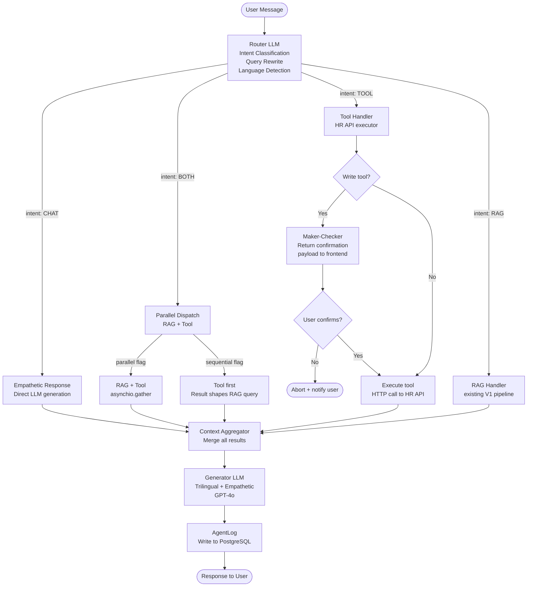
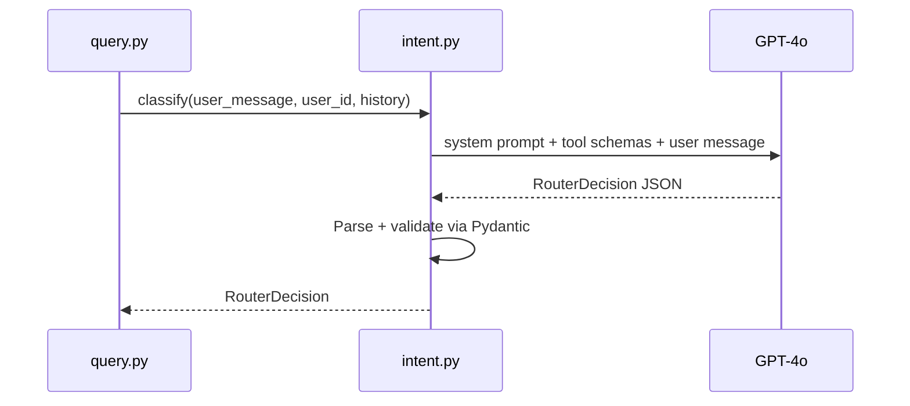
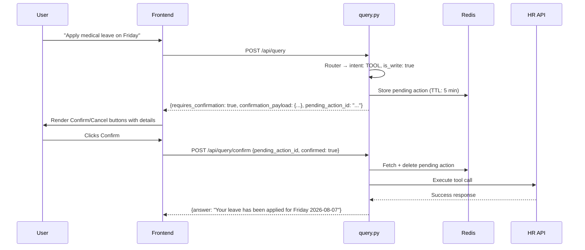
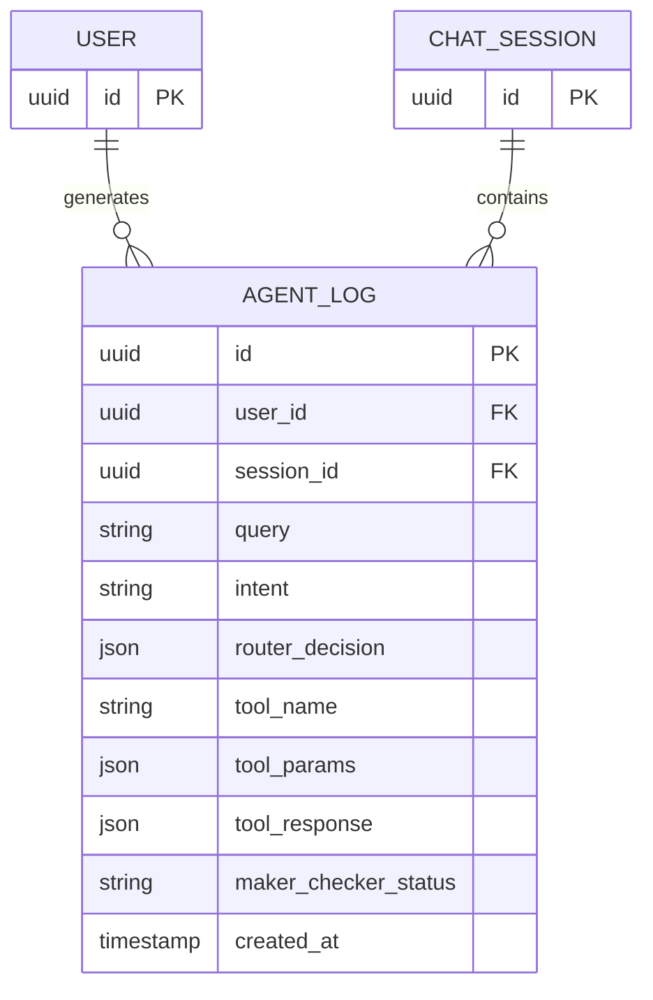
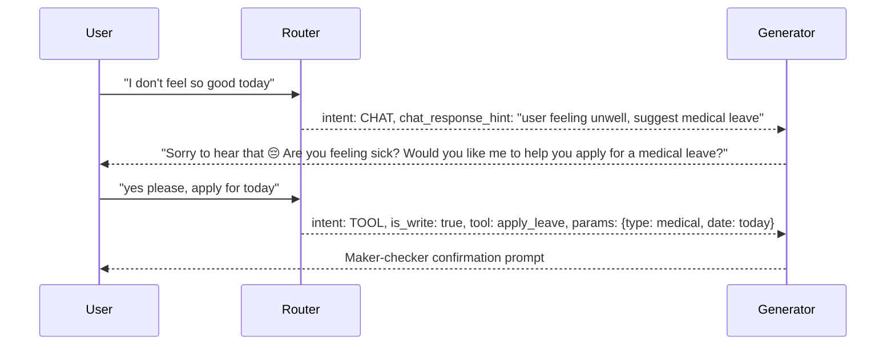

# Software Design Document (SDD)
# Astrynox AI — V2 Agentic Router + Tool Calling

**Version:** 2.0  
**Project:** Astrynox AI  
**Author:** Brayan K. Jayawardhana  
**Status:** Active  
**Builds On:** SDD v1.0 (Hybrid Multimodal RAG)

---

## Table of Contents

1. [What Changed from V1](#1-what-changed-from-v1)
2. [V2 System Overview](#2-v2-system-overview)
3. [High-Level Architecture](#3-high-level-architecture)
4. [Intent Router Design](#4-intent-router-design)
5. [Tool Handler Design](#5-tool-handler-design)
6. [Maker-Checker Design](#6-maker-checker-design)
7. [Audit Log Design](#7-audit-log-design)
8. [Multilingual + Empathetic Response Design](#8-multilingual--empathetic-response-design)
9. [Updated API Contracts](#9-updated-api-contracts)
10. [Data Design](#10-data-design)
11. [Caching Rules](#11-caching-rules)
12. [Updated Folder Structure](#12-updated-folder-structure)
13. [New Environment Variables](#13-new-environment-variables)
14. [Build Order](#14-build-order)
15. [LLM Configuration — Dev vs Production](#15-llm-configuration--dev-vs-production)

---

## 1. What Changed from V1

V1 was a pure RAG system — every query was answered from ingested documents. V2 adds an **agentic layer** on top of V1.

| Capability | V1 | V2 |
|---|---|---|
| Answer source | Company documents only | Documents + HR System APIs |
| Query routing | No routing — all queries go to RAG | LLM router classifies every query |
| Intent types | Implicit (always RAG) | RAG \| TOOL \| BOTH \| CHAT |
| HR data access | None | REST API calls to HR system |
| Write operations | None | Phase 2 — with maker-checker confirmation |
| Response language | English only | Matches user's input language |
| Empathetic handling | None | CHAT intent with contextual suggestions |
| Audit trail | QueryEvent (basic) | AgentLog (full decision + tool trace) |
| Caching | All RAG answers cached | Tool results never cached (user-specific) |

V1 components (ingestion pipeline, retrieval pipeline, generation) are unchanged. V2 wraps them with a routing layer.

---

## 2. V2 System Overview

When a user sends a message, an LLM-based router first classifies the intent before any retrieval or tool call happens. The router outputs a structured decision that the orchestrator uses to dispatch to the right handler — RAG, tool, both, or conversational.

```
User Message
      ↓
[Router LLM] ← classifies intent, rewrites query, detects language
      ↓
┌─────────┬──────────┬──────────┬──────────┐
│   RAG   │   TOOL   │   BOTH   │   CHAT   │
│         │          │          │          │
│ existing│ HR API   │ parallel │ empathy  │
│ pipeline│ executor │ (or seq) │ response │
└─────────┴──────────┴──────────┴──────────┘
               ↓
        [Write tool?] → Maker-checker confirmation
               ↓
      [Context Aggregator]
               ↓
      [Generator LLM] ← trilingual, empathetic
               ↓
      [AgentLog] ← audit every decision
```

---

## 3. High-Level Architecture



---

## 4. Intent Router Design

### 4.1 What the Router Does

The router is a single GPT-4o call that runs before any retrieval or tool execution. It:
1. Detects the user's language
2. Rewrites the query to be retrieval-friendly
3. Classifies intent into one of 4 categories
4. If TOOL or BOTH: identifies which tool to call and extracts parameters
5. If BOTH: determines whether parallel or sequential dispatch is needed

### 4.2 Intent Categories

| Intent | When Used | Example |
|---|---|---|
| `RAG` | Query answerable from company documents | "What is the maternity leave policy?" |
| `TOOL` | Query requires live HR system data | "What is my leave balance?" |
| `BOTH` | Query needs documents + live data | "Am I eligible for the bonus given my KPI?" |
| `CHAT` | Conversational / emotional / no data needed | "I don't feel well today" |

### 4.3 RouterDecision Schema

```python
class RouterDecision(BaseModel):
    intent: Literal["RAG", "TOOL", "BOTH", "CHAT"]
    language: Literal["en", "si", "ta"]          # detected from user message
    rag_query: str | None                          # rewritten, retrieval-friendly
    tool_name: str | None                          # from tool registry
    tool_params: dict | None                       # extracted from user message
    is_sequential: bool                            # BOTH only: tool result needed before RAG
    is_write: bool                                 # triggers maker-checker if True
    chat_response_hint: str | None                 # CHAT only: suggested pivot action
```

### 4.4 Router Flow



### 4.5 Router System Prompt (summary)

The router prompt instructs GPT-4o to:
- Detect language (English, Sinhala, Tamil, Singlish, Tamil-in-English all supported)
- Classify intent strictly into one of the 4 categories
- Extract tool name and parameters when intent is TOOL or BOTH
- Flag `is_sequential: true` only when the RAG query cannot be formed without the tool result
- Flag `is_write: true` for any tool that modifies data
- Return a JSON object matching `RouterDecision` — no prose, no explanation

### 4.6 BOTH — Parallel vs Sequential

**Parallel (default):** Both handlers run simultaneously via `asyncio.gather`. Used when RAG and tool results are independent.

```
"What is my leave balance and what is the company leave policy?"
  ├── RAG: "company leave policy"          ← fires immediately
  └── TOOL: get_leave_balance(user_id)     ← fires immediately
```

**Sequential:** Tool runs first, its result is injected into the RAG query. Used when the RAG search depends on knowing the tool result.

```
"Am I eligible for the bonus given my KPI achievement?"
  1. TOOL: get_kpi_achievement(user_id)  → {score: 87%}
  2. RAG: "bonus eligibility for KPI score 87%"
```

---

## 5. Tool Handler Design

### 5.1 Tool Registry

Tools are defined using OpenAI function calling schema format. Each tool has:
- `name` — unique identifier, used by the router
- `description` — natural language description for the router LLM
- `parameters` — JSON Schema for input validation
- `endpoint` — HR API endpoint pattern
- `method` — HTTP method (GET for phase 1 read-only)

### 5.2 Phase 1 Tool List (Read-Only)

| Tool Name | Description | Key Params |
|---|---|---|
| `get_leave_balance` | Get remaining leave days by type | `user_id` |
| `get_kpi_achievement` | Get current KPI score and status | `user_id` |
| `get_team_members` | List team members under same manager | `user_id` |
| `get_directory_details` | Get contact details for a role or person | `role` or `name` |
| `get_payslip_summary` | Get salary and deduction summary | `user_id`, `month`, `year` |

> Phase 2 will add write tools (apply leave, raise request, update profile) — all gated by maker-checker.

### 5.3 Tool Executor

`executor.py` is a thin HTTP client that:
1. Looks up the tool definition from the registry
2. Builds the HTTP request (URL + params + service token header)
3. Calls the HR API
4. Returns the raw JSON response or raises a `ToolCallError`

```python
async def execute_tool(tool_name: str, tool_params: dict) -> dict:
    tool = TOOL_REGISTRY[tool_name]
    url = settings.hr_api_base_url + tool.endpoint.format(**tool_params)
    headers = {"Authorization": f"Bearer {settings.hr_api_token}"}
    async with httpx.AsyncClient() as client:
        response = await client.get(url, headers=headers, timeout=10)
        response.raise_for_status()
        return response.json()
```

### 5.4 Tool Call Failure Handling

| Scenario | Response |
|---|---|
| HR API unreachable | Return: "I couldn't retrieve that information right now. Please try again." |
| HR API returns 404 | Return: "No data found for your query." |
| HR API returns 500 | Return: "The HR system is currently unavailable." |
| Tool not in registry | Router error — log and return fallback message |

Tool call results are **never cached** — they are user-specific, real-time, sensitive values. See Section 11.

---

## 6. Maker-Checker Design

### 6.1 Overview

For write operations (phase 2), the system never executes immediately. It:
1. Identifies the intended write action from the router decision
2. Builds a structured confirmation payload
3. Returns it to the frontend with `requires_confirmation: true`
4. Stores the pending action in Redis with a TTL
5. Waits for user to click Confirm or Cancel
6. On confirm: executes the tool call and logs the outcome

### 6.2 Confirmation Flow



### 6.3 Pending Action Redis Schema

```
Key:   pending:{session_id}:{action_id}
Value: JSON {
    tool_name: str,
    tool_params: dict,
    summary: str,         ← human-readable description for confirmation UI
    user_id: str,
    created_at: ISO timestamp
}
TTL: 300 seconds (5 minutes — expires if user doesn't respond)
```

### 6.4 Confirmation Payload (returned to frontend)

```json
{
  "requires_confirmation": true,
  "pending_action_id": "uuid",
  "confirmation_payload": {
    "action": "Apply Medical Leave",
    "details": {
      "leave_type": "Medical",
      "date": "2026-08-07",
      "duration": "1 day"
    },
    "message": "Please confirm your leave application for Friday, 2026-08-07 (Medical Leave)."
  }
}
```

---

## 7. Audit Log Design

### 7.1 What Gets Logged

Every query — regardless of intent — writes one row to `agent_logs`. This gives a complete, queryable audit trail of all system decisions and actions.

| Field | What it captures |
|---|---|
| `intent` | RAG / TOOL / BOTH / CHAT |
| `router_decision` | Full JSON output from the router LLM |
| `tool_name` | Which tool was called (if any) |
| `tool_params` | Parameters passed to the tool |
| `tool_response` | Raw JSON response from HR API |
| `maker_checker_status` | pending / confirmed / cancelled (write tools only) |

### 7.2 AgentLog Model

```python
class AgentLog(Base):
    __tablename__ = "agent_logs"

    id: UUID                          # primary key
    user_id: UUID                     # FK → users.id
    session_id: UUID                  # FK → chat_session.id
    query: str                        # original user message (pre-rewrite)
    intent: str                       # RAG | TOOL | BOTH | CHAT
    router_decision: dict             # JSON — full RouterDecision output
    tool_name: str | None             # null for RAG and CHAT
    tool_params: dict | None          # JSON — null for RAG and CHAT
    tool_response: dict | None        # JSON — null for RAG and CHAT
    maker_checker_status: str | None  # null for read tools and RAG
    created_at: datetime
```

### 7.3 AgentLog ERD



---

## 8. Multilingual + Empathetic Response Design

### 8.1 Language Support

The system supports trilingual queries natively via GPT-4o:

| Input Type | Example | Handled By |
|---|---|---|
| English | "What is my leave balance?" | GPT-4o native |
| Sinhala (Unicode) | "මගේ නිවාඩු ශේෂය කීයද?" | GPT-4o native |
| Tamil (Unicode) | "என் விடுமுறை இருப்பு என்ன?" | GPT-4o native |
| Singlish | "mage niwadu seshaya kiyada?" | Router normalizes + GPT-4o |
| Tamil in English | "en leave balance evvalavu?" | Router normalizes + GPT-4o |

**Response language rule:** the generation LLM always responds in the same language as the user's input. The router detects and passes `language` to the generator prompt.

### 8.2 CHAT Intent — Empathetic Response

The `CHAT` intent handles messages that are conversational, emotional, or sensitive — not answerable by documents or tools.



The `chat_response_hint` from the router guides the generator to offer a relevant next action (e.g., apply leave, contact HR) without forcing it — the response remains conversational.

### 8.3 Generator System Prompt Updates (V2)

The generation system prompt is updated to:
- Always respond in the language specified by `{language}` parameter
- Treat emotional/sensitive messages with empathy first, action second
- Offer a follow-up action suggestion when `chat_response_hint` is present
- Never expose internal tool names, API responses, or system details to the user
- Maintain citation format for RAG-sourced content as in V1

---

## 9. Updated API Contracts

### 9.1 POST /api/query (updated)

**Request:** unchanged from V1
```json
{
  "query": "What is my leave balance?",
  "session_id": "uuid"
}
```

**Response — standard (RAG or TOOL, no write):**
```json
{
  "answer": "You have 5 annual, 4 medical, and 7 casual leave days remaining.",
  "citations": [],
  "requires_confirmation": false,
  "confirmation_payload": null,
  "pending_action_id": null
}
```

**Response — write tool (maker-checker triggered):**
```json
{
  "answer": null,
  "citations": [],
  "requires_confirmation": true,
  "pending_action_id": "uuid",
  "confirmation_payload": {
    "action": "Apply Medical Leave",
    "details": {
      "leave_type": "Medical",
      "date": "2026-08-07",
      "duration": "1 day"
    },
    "message": "Please confirm your leave application for Friday, 2026-08-07 (Medical Leave)."
  }
}
```

---

### 9.2 POST /api/query/confirm (new)

Called by the frontend when the user clicks Confirm or Cancel on a maker-checker prompt.

**Request:**
```json
{
  "pending_action_id": "uuid",
  "confirmed": true
}
```

**Response (confirmed):**
```json
{
  "answer": "Your medical leave for 2026-08-07 has been successfully applied.",
  "citations": [],
  "requires_confirmation": false,
  "confirmation_payload": null,
  "pending_action_id": null
}
```

**Response (cancelled):**
```json
{
  "answer": "Leave application cancelled. Let me know if you need anything else.",
  "citations": [],
  "requires_confirmation": false,
  "confirmation_payload": null,
  "pending_action_id": null
}
```

---

## 10. Data Design

### 10.1 Updated QueryResponse Schema

```python
class QueryResponse(BaseModel):
    answer: str | None
    citations: list[dict]
    requires_confirmation: bool = False
    confirmation_payload: dict | None = None
    pending_action_id: str | None = None
```

### 10.2 ConfirmRequest Schema

```python
class ConfirmRequest(BaseModel):
    pending_action_id: str
    confirmed: bool
```

### 10.3 Tool Definition Schema

```python
class ToolDefinition(BaseModel):
    name: str
    description: str
    parameters: dict       # OpenAI function calling JSON Schema
    endpoint: str          # HR API endpoint pattern e.g. "/employees/{user_id}/leave-balance"
    method: str = "GET"
    is_write: bool = False
```

### 10.4 Redis Keys (V2 additions)

| Purpose | Key Pattern | TTL |
|---|---|---|
| Pending maker-checker action | `pending:{session_id}:{action_id}` | 300s |
| Answer cache (RAG only) | `l1:answer:{query}` | 3600s |
| Embedding cache | `l2:embedding:{query}` | 7 days |
| Retrieval cache | `l3:retrieval:{query}` | 1800s |

---

## 11. Caching Rules

| Data type | Cached? | Reason |
|---|---|---|
| RAG answers | Yes — L1 (1 hour) | Same answer for all users, static content |
| BOTH answers (RAG + tool merged) | No | Contains user-specific tool data |
| Tool call results | Never | User-specific, real-time, sensitive |
| CHAT responses | No | Contextual, session-specific |
| Query embeddings | Yes — L2 (7 days) | Query text → vector, not user-specific |
| Retrieval results | Yes — L3 (30 min) | Chunk retrieval, not user-specific |

**Rule:** if the response contains any data from a tool call, it is never written to the L1 answer cache. The orchestrator is responsible for enforcing this — `set_answer()` is only called on pure RAG responses.

---

## 12. Updated Folder Structure

New files and directories added in V2 (existing V1 structure unchanged):

```
app/
├── api/
│   └── routes/
│       └── query.py              ← major rewrite: orchestrator + /confirm endpoint
│
├── services/
│   ├── router/
│   │   └── intent.py             ← NEW: LLM router, returns RouterDecision
│   │
│   ├── tools/
│   │   ├── registry.py           ← NEW: tool definitions (OpenAI function schemas)
│   │   ├── executor.py           ← NEW: HTTP client for HR API calls
│   │   └── pending.py            ← NEW: Redis store for maker-checker pending actions
│   │
│   └── generation/
│       └── llm.py                ← updated: trilingual + empathetic system prompt
│
├── models/
│   └── agent_log.py              ← NEW: AgentLog SQLAlchemy model
│
└── schemas/
    ├── query.py                  ← updated: QueryResponse gains confirmation fields
    └── agent.py                  ← NEW: RouterDecision, ConfirmRequest schemas
```

---

## 13. New Environment Variables

Add to `.env` and `.env.sample`:

```env
# HR System API
HR_API_BASE_URL=https://hr.internal.company.com/api/v1
HR_API_TOKEN=shared_service_token_here

# LLM — switch between dev (OpenAI) and prod (vLLM) via these three vars only
LLM_BASE_URL=https://api.openai.com/v1
LLM_API_KEY=sk-...
LLM_MODEL=gpt-4o
```

---

## 14. Build Order

| Step | File | Type |
|---|---|---|
| 1 | `app/models/agent_log.py` | New model + Alembic migration |
| 2 | `app/schemas/agent.py` | RouterDecision + ConfirmRequest schemas |
| 3 | `app/schemas/query.py` | Add confirmation fields to QueryResponse |
| 4 | `app/services/tools/registry.py` | Tool definitions |
| 5 | `app/services/tools/executor.py` | HR API HTTP client |
| 6 | `app/services/tools/pending.py` | Redis pending action store |
| 7 | `app/services/router/intent.py` | Router LLM call |
| 8 | `app/api/routes/query.py` | Orchestrator rewrite + /confirm endpoint |
| 9 | `app/services/generation/llm.py` | System prompt update |
| 10 | `frontend/app/chat/page.tsx` | Confirmation UI (Confirm/Cancel buttons) |

> Tool schemas (Step 4) can be written with mock responses until the HR API documentation is available. Only `executor.py` (Step 5) needs to change when real endpoints are confirmed.

---

---

## 15. LLM Configuration — Dev vs Production

### 15.1 Overview

All LLM calls (router, tool selection, generation) use a single abstracted client configured via environment variables. Switching from development to production requires only changing three env vars — no code changes.

| Environment | Model | Served By |
|---|---|---|
| Development | GPT-4o | OpenAI API |
| Production | Qwen 3 8B FP4 | vLLM (self-hosted) |

Both expose an OpenAI-compatible REST API (`/v1/chat/completions`), so the Python OpenAI SDK works identically in both environments.

---

### 15.2 vLLM Serve Command (Production)

```bash
vllm serve Qwen/Qwen3-8B \
  --quantization fp4 \
  --dtype auto \
  --tensor-parallel-size 1 \
  --api-key your-vllm-service-token \
  --port 8001 \
  --host 0.0.0.0 \
  --enable-auto-tool-choice \
  --tool-call-parser hermes
```

**Flag explanations:**

| Flag | Purpose |
|---|---|
| `--quantization fp4` | FP4 quantization — requires NVIDIA Hopper (H100/H200) or Blackwell (B100/B200) GPU |
| `--dtype auto` | Let vLLM select the optimal compute dtype for the hardware |
| `--tensor-parallel-size 1` | Single GPU — increase if multi-GPU available |
| `--api-key` | Service token — set to match `LLM_API_KEY` in `.env` |
| `--port 8001` | Avoids conflict with FastAPI on 8000 |
| `--enable-auto-tool-choice` | Enables OpenAI-compatible function calling |
| `--tool-call-parser hermes` | Qwen 3 uses the Hermes tool call format — required for structured tool output |

---

### 15.3 Environment Variable Switch

**Development `.env`:**
```env
LLM_BASE_URL=https://api.openai.com/v1
LLM_API_KEY=sk-your-openai-key
LLM_MODEL=gpt-4o
```

**Production `.env`:**
```env
LLM_BASE_URL=http://localhost:8001/v1
LLM_API_KEY=your-vllm-service-token
LLM_MODEL=Qwen/Qwen3-8B
```

---

### 15.4 LLM Client (shared across router + generator)

All LLM calls go through a single client instance:

```python
from openai import AsyncOpenAI
from app.core.config import settings

llm_client = AsyncOpenAI(
    base_url=settings.llm_base_url,
    api_key=settings.llm_api_key,
)
```

`settings.llm_model` is passed as the `model` parameter on each call. This is the only place the model name appears — no hardcoded `"gpt-4o"` strings anywhere in service code.

---

### 15.5 Qwen 3 Structured Output Considerations

Qwen 3 8B FP4 is capable but smaller than GPT-4o. For the router's `RouterDecision` JSON output:

- Use vLLM's `--enable-auto-tool-choice` + `--tool-call-parser hermes` to get reliable structured tool call output
- The router prompt must be explicit — include the exact JSON schema in the system prompt as a fallback
- Test router JSON conformance thoroughly before production deployment
- If JSON parsing fails, implement a retry with a simplified prompt rather than crashing

---

*Astrynox AI — SDD v2.0*
